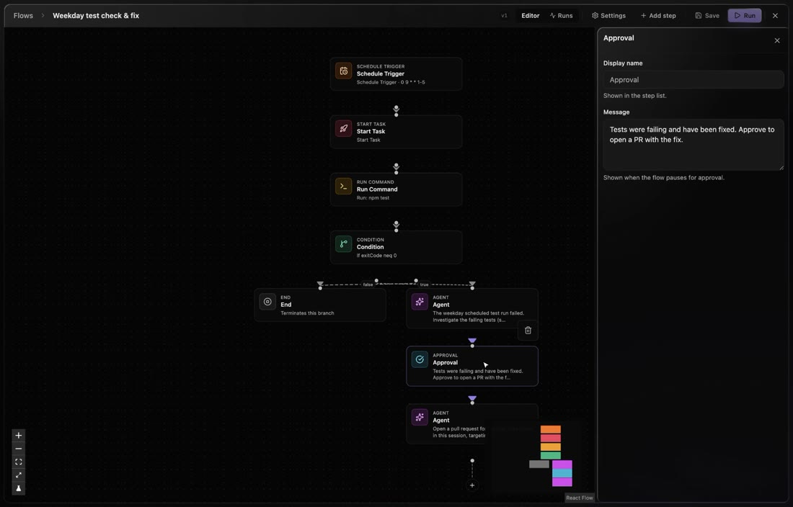
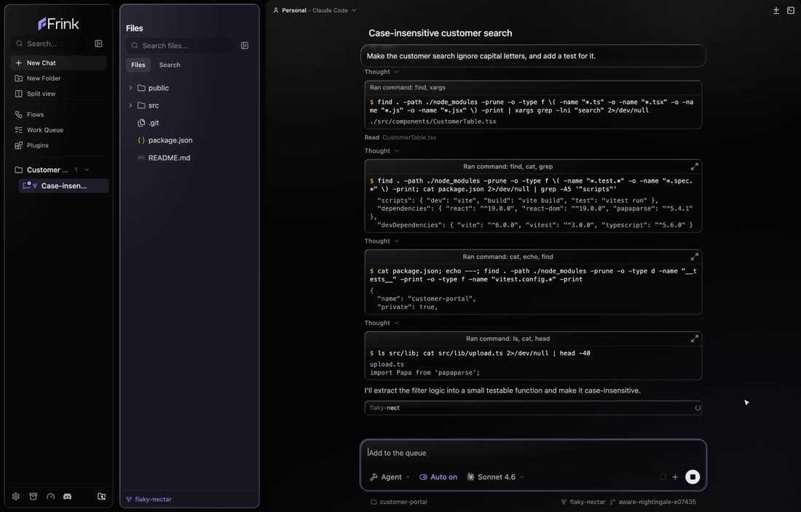
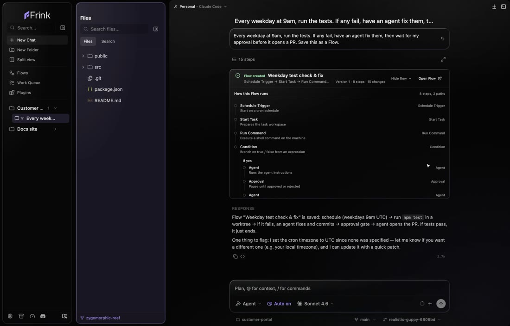
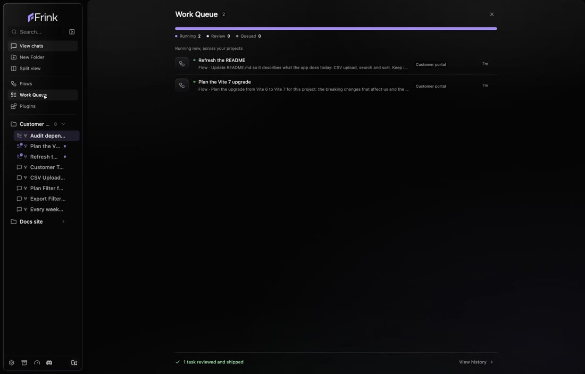
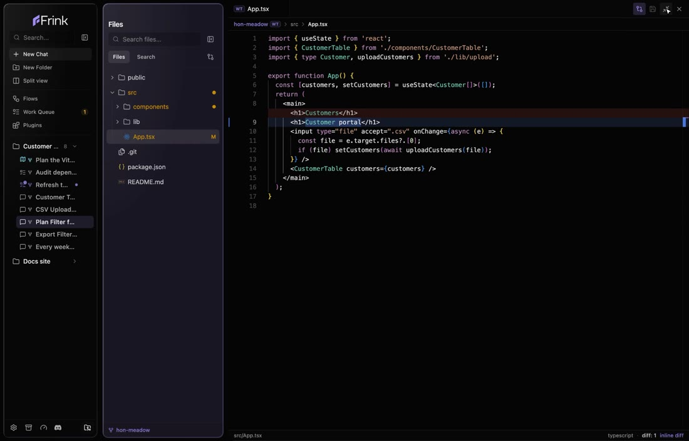

<h1 align="center">
   Frink
</h1>

  
  
  

  <strong>Build your agent workflow once. Frink runs it every time.</strong> 
  A ticket arrives, an error fires or the clock hits 9am: your Flow runs the steps you chose and stops where it needs you.

  Triggers from Linear, Jira, Shortcut, ClickUp, Sentry, PostHog, Vercel and more, plus any webhook or a schedule. 
  Stuck agents wait in the Work Queue for your yes, on your Mac or from your iPhone (beta). 
  It runs on your machine with your own Claude Code or Codex login. No Frink account.

  A friendly AI development tool for everyone: start with a chat, save it as a Flow, run agents side by side.

<h3 align="center"><a href="https://frink.dev/download"><ins>Download Frink</ins></a></h3>

  <a href="user-docs/flows.md"><picture><source srcset="docs/assets/readme/triggers.gif" type="image/gif"></picture></a>

## Features

<table>
<tr>
<td width="50%" valign="middle">

### Start with a chat

Describe it the way you would to a colleague. The agent builds it and shows its work as it goes — no setup, no jargon.

[Docs →](user-docs/getting-started.md)

</td>
<td width="50%">
  <a href="user-docs/getting-started.md"><picture><source srcset="docs/assets/readme/chat.gif" type="image/gif"></picture></a>
</td>
</tr>
<tr>
<td width="50%" valign="middle">

### Save it as a Flow

Turn a one-off chat into a repeatable automation: what sets it off, what the agent does, what happens next. Then it runs itself.

[Docs →](user-docs/flows.md)

</td>
<td width="50%">
  <a href="user-docs/flows.md"><picture><source srcset="docs/assets/readme/flow.gif" type="image/gif"></picture></a>
</td>
</tr>
<tr>
<td width="50%" valign="middle">

### Triggers from your tools

Start a Flow from a schedule, a Linear or Shortcut ticket, a Sentry error, a PostHog event or any webhook. Add a condition, and a step where it stops and asks you.

[Docs →](user-docs/plugins.md)

</td>
<td width="50%">
  <a href="user-docs/plugins.md"><picture><source srcset="docs/assets/readme/triggers.gif" type="image/gif"></picture></a>
</td>
</tr>
<tr>
<td width="50%" valign="middle">

### One place for what needs you

Running, ready for review, queued: every run across your projects, with a badge when one needs your answer. Approve, edit, or send it back.

[Docs →](user-docs/task-lifecycle.md)

</td>
<td width="50%">
  <a href="user-docs/task-lifecycle.md"><picture><source srcset="docs/assets/readme/queue.gif" type="image/gif"></picture></a>
</td>
</tr>
<tr>
<td width="50%" valign="middle">

### Or write it yourself

A real editor and terminal for your files, with changes you mark viewed and checkpoints to roll back to.

[Docs →](user-docs/files.md)

</td>
<td width="50%">
  <a href="user-docs/files.md"><picture><source srcset="docs/assets/readme/editor.gif" type="image/gif"></picture></a>
</td>
</tr>
</table>

**Also in the box:**

- **[Worktree per chat](user-docs/worktree-setup.md)** — every agent works on its own git worktree, so parallel work never collides.
- **[Permissions](user-docs/permissions.md)** — every tool call passes a per-project gate first; `~/.ssh`, `~/.aws` and `.env` are always off-limits.
- **[Plugins & MCP](user-docs/mcp-servers.md)** — connect Linear, Shortcut, ClickUp, GitHub, Notion, Slack, Sentry, PostHog and more, as chat tools and Flow steps.
- **[Your own AI sign-in](user-docs/ai-accounts.md)** — uses your existing Claude Code or Codex login. Frink never stores the token.
- **Local-first** — chats, Flows, tasks and permissions live in SQLite on your machine. No account needed. Official builds send anonymous usage counts and crash reports: [everything Frink sends](user-docs/telemetry.md).

---

## Supported Agents

  <a href="https://docs.anthropic.com/claude/docs/claude-code"><kbd> Claude Code</kbd></a> &nbsp;
  <a href="https://github.com/openai/codex"><kbd> Codex</kbd></a>

Bring your own subscription or API key — Frink runs the agent, you keep the account.

---

## Install

- **[Download from frink.dev](https://frink.dev/download)**
- Or grab a build directly: [macOS Apple Silicon](https://pub-c942ee0fa0a549ef8d66096bd831507b.r2.dev/Frink-0.2.0-arm64.dmg) · [macOS Intel](https://pub-c942ee0fa0a549ef8d66096bd831507b.r2.dev/Frink-0.2.0.dmg)
- Or build from source — see [CONTRIBUTING.md](CONTRIBUTING.md).

### Linux (x64)

Download the AppImage or the `.deb` from [frink.dev/download](https://frink.dev/download). Both update themselves. Linux builds appear there from the first release that includes them; until then, build from source.

- **AppImage** (any distro): `chmod +x Frink-X.Y.Z.AppImage && ./Frink-X.Y.Z.AppImage`, with `X.Y.Z` the version you downloaded. It does not need libfuse2: it mounts itself with `fusermount3` from the `fuse3` package. If it will not start, install `fuse3` or start it with `--appimage-extract-and-run`. Keep it in a folder you can write to, such as `~/Applications`, so updates can replace it.
- **.deb** (Debian/Ubuntu): `sudo apt install ./frink_X.Y.Z_amd64.deb`. Updates ask for your password in a system prompt.

Frink saves API keys and MCP credentials only when it can encrypt them with a desktop keyring (GNOME Keyring or KWallet). Without one it does not save them, so install one and relaunch Frink before adding accounts.

---

## Community & Support

- **Bugs & ideas:** [open an issue](https://github.com/benord-labs/frink/issues).
- **Changelog:** [frink.dev/changelog](https://frink.dev/changelog).
- **Show support:** [star](https://github.com/benord-labs/frink) the repo to follow along.

---

## Developing

Want to contribute or run locally? See our [CONTRIBUTING.md](CONTRIBUTING.md) guide.

## License

Frink is licensed under the [MIT License](LICENSE). Copyright 2026 Benji Norval.

Third-party licenses are listed in [THIRD_PARTY_LICENSES.md](THIRD_PARTY_LICENSES.md).
